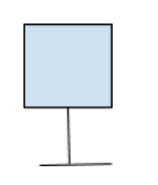
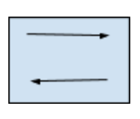
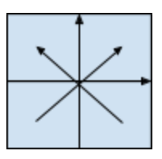
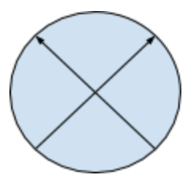

# Настройка

## Иероглифы на доске

1. Хост:

	

2. Коммутатор второго уровня:

	

3. Коммутатор третьего уровня:
	
	

4. Маршрутизатор:

	

##Коммутатор

1. Включаем
2. Берём голубой проводочек, к нему берём маленький серенький, соединяем их. Втыкаем серенький в USB-порт компьютера, на котором будем настраивать коммутатор. Конец голубого проводочка втыкаем в консольный порт коммутатора(он находится с задней части коммутатора)
3. Залезаем в _Device Manager_ и ищем в строке *Ports* номер *COM*, который относится к нашему серенькому проводочку(можно его выткнуть и воткнуть обратно, посмотрев, что изменялось). Допустим, мы увидели *COM4*. Запускаем _Putty_, выбираем *serial* вводим в окошечко *COM4* и запускаем
4. Бывает, окошечко _Putty_ ничего не отображает, покликайте enter. Вам могут там чего-то сразу предложить, отвечайте *no*
5. Мы должны увидеть пользовательский режим:

	```
	Switch>
	```

6. Чтобы перейти в привилегированный режим:

	```
	Switch>enable
	Switch#
	```

7. Чтобы войти в режим глобальной конфигурации:

	```
	Switch#configure terminal
	Switch(config)#
	```

8. Чтобы задать имя устройству:

	```
	Switch(config)#hostname nata-switch
	nata-switch(config)#
	```

9. Делаем так, чтобы логи не мешали:

	```
	nata-switch(config)#no ip domain-lookup
	nata-switch(config)#line con 0
	nata-switch(config)#logging sync
	```

## VLAN в Cisco

- access port – это порт, который принадлежит к одному VLAN, и может передавать нетегированный информационный трафик;
- trunk port – это коммутационный порт, посредством которого может передаваться тегированный трафик от одного либо нескольких VLAN.  


1. Создать vlan 
	- Создадим (допустим создать второй vlan):
		```
		sw1(config)# vlan 2 
		```
	- Присвоим ему имя:
		```
		sw1(config-vlan)# name myvlan
		```
	- Если нам нужно удалить vlan, то: 
		```
		sw1(config)# no vlan 2 
		```

2. Настроим порты доступа. У нас в интерфейсы коммутатора подключены устройства. Мы хотим задать для этих интерфейсов, к какому vlan они относятся. Допустим мы хотим назначить на первый интерфейс второй vlan
	- Заходим в конфигурацию интерфейса:
		```
		sw1(config)# interface fa0/1
		```
	- Ставим режим доступа:
		```
		sw1(config-if)# switchport mode access
		```
	- Ставим, что этот интерфейс относится к vlan 2 :
		```
		sw1(config-if)# switchport access vlan 2
		```
	- Чтобы настроить диапазон интерфейсов(например на 4 и 5 установить vlan 10)
		```
		sw1(config)# interface range fa0/4 - 5
		sw1(config-if-range)# switchport mode access 
		sw1(config-if-range)# switchport access vlan 10 
		```

3. Чтобы посмотреть информацию о состоянии VLAN:
	```
	sw1# show vlan brief
	```


## Настройка Trunk

1. Для начала настроим все нужные vlan 
2. Чтобы указать, что данный интерфейс должен быть в режиме trunk:
	```
	sw1(config)# interface fa0/22
	sw1(config-if)# switchport mode trunk
	```
3. Теперь мы должны разрешить те vlan, что могут передаваться через порт в режиме trunk:
	```
	sw1(config)# interface fa0/22
	sw1(config-if)# switchport trunk allowed vlan 1-2,10,15
	```
4. Чтобы добавить ещё один разрешённый vlan:
	```
	sw1(config)# interface fa0/22
	sw1(config-if)# switchport trunk allowed vlan add 160
```
5. Чтобы удалить vlan из списка разрешённых:
	```
	sw1(config)# interface fa0/22	 
	sw1(config-if)# switchport trunk allowed vlan remove 160
	```  

6. На некоторых моделях коммутаторов (на которых поддерживается ISL) после попытки перевести интерфейс в режим статического транка, может появится такая ошибка:

	```
	sw1(config-if)# switchport mode trunk
	Command rejected: An interface whose trunk encapsulation is “Auto” can not be configured to “trunk” mode.
	```

Это происходит из-за того, что динамическое определение инкапсуляции (ISL или 802.1Q) работает только с динамическими режимами транка. И для того, чтобы настроить статический транк, необходимо инкапсуляцию также настроить статически.  
Для таких коммутаторов необходимо явно указать тип инкапсуляции для интерфейса:
	```
	sw1(config-if)# switchport trunk encapsulation dot1q 
	```

И после этого снова повторить команду настройки статического транка (switchport mode trunk).  

В стандарте 802.1Q существует понятие [native VLAN](http://xgu.ru/wiki/Native_VLAN). Трафик этого VLAN передается нетегированным. По умолчанию это VLAN 1. Однако можно изменить это и указать другой VLAN как native.  
Настройка VLAN 5 как native:

	```
	sw1(config-if)# switchport trunk native vlan 5
	```

[Взято отсюда](http://xgu.ru/wiki/VLAN_%E2_Cisco)


